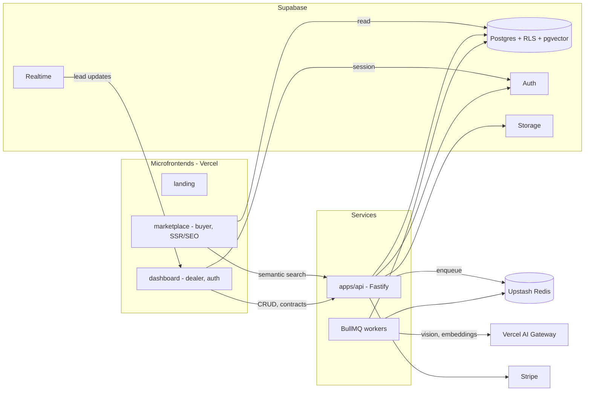

# Architecture — SELECTCARS

## Overview

A Turborepo monorepo. Frontends are composed as **microfrontends** (Vercel) under one domain. A dedicated Node **API service** hosts business logic and async workers. **Supabase** is the data backbone (Postgres + RLS + Auth + pgvector + Storage + Realtime). **BullMQ + Redis** run AI and email jobs off the request path.

## Key decisions

- **Multi-tenancy = RLS** (not schema-per-tenant). Every business table has `tenant_id`; policies enforce isolation. Proven in a POC before any CRUD (Phase 1). See ADR `001`.
- **Contracts shared** via `packages/shared` (Zod). API and frontends import the same schemas.
- **AI is always async** (BullMQ). HTTP never blocks on a model call.
- **Realtime** lead updates via Supabase Realtime (buyer inquiry → dealer Kanban updates live).
- **Microfrontends** let marketplace/dashboard/landing deploy independently while sharing `packages/ui`.

## Repos & packages

See [`staks/00-overview.md`](./staks/00-overview.md) for the full stack table and the monorepo layout is described in the development guide and the roadmap. ADRs live in [`adr/`](./adr/).

## Data flow: buyer inquiry (happy path)

1. Buyer submits interest on a marketplace vehicle page.
2. `apps/api` validates (Zod), writes the lead with `tenant_id`, enqueues scoring.
3. Supabase Realtime pushes `lead:created` to the dealer dashboard → new Kanban card.
4. Worker scores the lead (AI) and updates the record; dashboard reflects the score.
5. Salesperson schedules a test drive; a confirmation email is queued (BullMQ + Resend).
